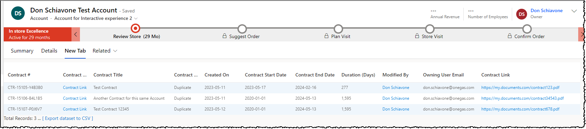
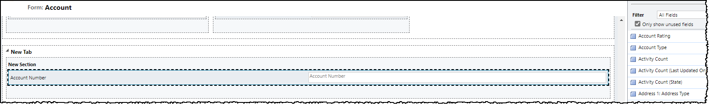
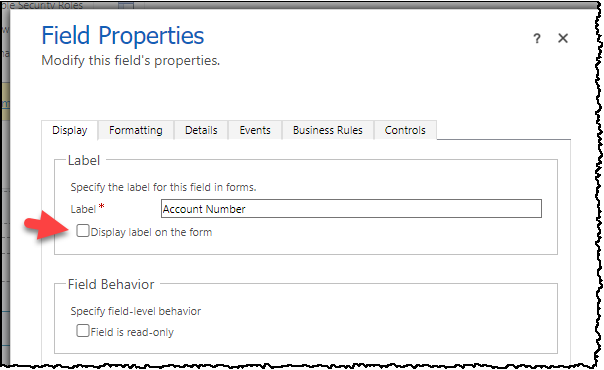
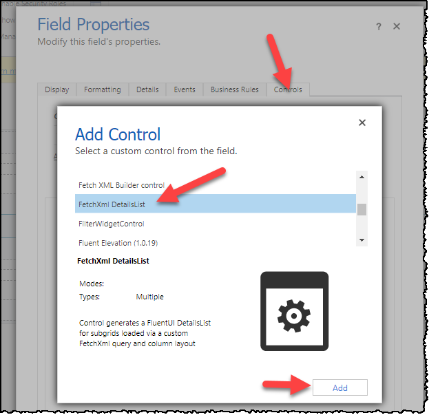
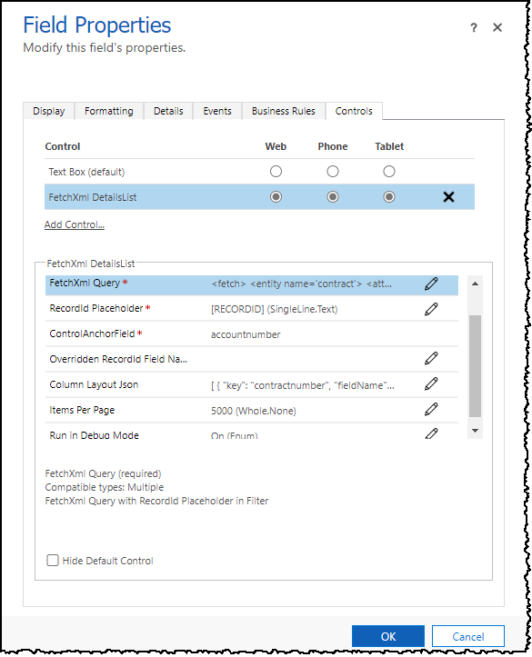
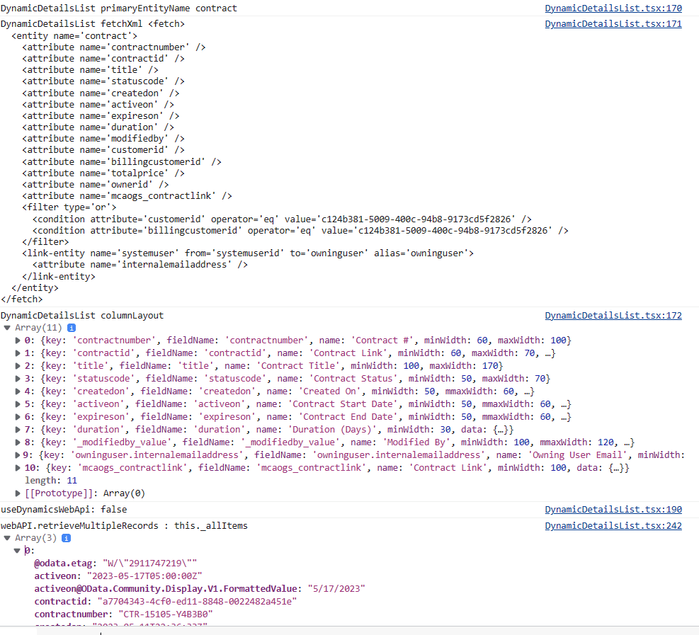
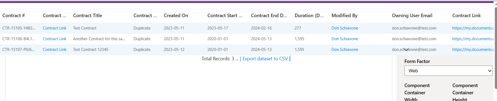

# [FetchXml DetailsList](https://github.com/donschia/FetchXmlDetailsList)
## Description
This PCF Control generates a FluentUI DetailsList for subgrids loaded via a custom FetchXml query and column layout. This extends the query capabilities beyond the standard Model-Driven App subgrid.  You need to include an ID Placeholder which is replaced at runtime with the current record id.  It is also possible to pass in an id from the current record to be replaced in the same fashion.

---


This solution was created to meet some recent challenges.  Specifically, I have fairly complex data models that vary based on some data points.  I am able to create multiple subgrids and switch between them via simple form JavaScript.  Another challenge was when Microsoft removed the Contract entity making it no longer possible to view in the modern UI.  So until we are able to migrate all of the data (and the super complex data models) to a new entity, we need to be able to navigate to Contract records.  This solution allows us to render links to Contracts using the classic web interface.

I had searched in vain for a similar FetchXml driven subgrid control so this seemed like a good enough reason to roll up the sleeves and try my hand at a PCF control.  It's far from perfect and uses some hacks, but it does solve some real issues for us in the meantime.

## Features
- Dynamic queries can be more complex than model driven apps views allow, for example with many more linked entities.  You can even include links to entities that are no longer available in the new user interface (i.e., Contract).
- Uses [FluentUI DetailsList]( https://developer.microsoft.com/en-us/fluentui#/controls/web/detailslist) with a familiar look and feel - similar to model-driven read-only subgrid, supporting basic sorting and resizing of columns.  
- Double clicking a row navigates to the base record and supports navigation to linked entities.
- Customization options for each column include date formatting, toggleable entity linking, absolute URLs, relative URLs, [Combined Fields](#CombinedFields), and so on.
- Debug mode shows all data returned from FetchXml query for building the column layout.
- Uses Placeholder to filter by a record id.  This defaults to the current record.  But this can be overridden with another lookup on the current form.
- Quick rendering, even for larger datasets.  
***

## Quick Start using Pre-Built Solution
A [Managed or Unmanaged Solution](https://github.com/donschia/FetchXmlDetailsList/tree/master/solution/bin/Release) is available to download and install in your development environment.  

1. After installing, you add the control to your form via the legacy or modern designer (I use legacy due to field length issue described later).  Simply add any text field and bind this control to it. 


2. Be sure to hide the label. 


3. Go to the Controls tab and pick the `FetchXml DetailsList`.

4. Set the radio buttons so the control is visible, and set the Input Parameters.


### Set Up Notes
Both the new and legacy designers will likely not allow you to paste in text long enough for more elaborate FetchXml queries and Column Layouts, so you have to use the legacy designer and a [workaround to extend the field length](https://powerusers.microsoft.com/t5/Power-Apps-Pro-Dev-ISV/Problem-with-maximum-length-of-Input-parameters-which-are-of/td-p/288295).  
Essentially you use the legacy designer and hack the input box via F11 dev tools to set the maxlength to something like 9999 instead of the default 2000 if your text doesn't fit.
***
## Input Parameters (Properties)
The grid has input parameters which must be set.

- <code>FetchXml</code> is the full FetchXml with a placeholder for the Record Id in place. In this example we can show all contracts where the current Account is the Customer or the Billing Customer.  
```xml
<fetch>
  <entity name='contract'>
    <attribute name='contractnumber' />
    <attribute name='contractid' />
    <attribute name='title' />
    <attribute name='statuscode' />
    <attribute name='createdon' />
    <attribute name='activeon' />
    <attribute name='expireson' />
    <attribute name='duration' />
    <attribute name='modifiedby' />
    <attribute name='customerid' />
    <attribute name='billingcustomerid' />
    <attribute name='totalprice' />
    <attribute name='ownerid' />
    <attribute name='mcaogs_contractlink' />
    <filter type='or'>
      <condition attribute='customerid' operator='eq' value='[RECORDID]' />
      <condition attribute='billingcustomerid' operator='eq' value='[RECORDID]' />
    </filter>
    <link-entity name='systemuser' from='systemuserid' to='owninguser' alias='owninguser'>
      <attribute name='internalemailaddress' />
    </link-entity>
  </entity>
</fetch>
```

- <code>RecordIdPlaceholder</code> is the placeholder text. This will be replaced with the current record id.  
i.e. <code>[RECORDID]</code>

- The <code>Record Id</code> is read from the current record in a bit of a hack at the moment as it's not super easy to get this in the Power Apps framework.  This can also be overridden with another lookup on the current form.  Simply set the <code>OverriddenRecordIdFieldName</code> to a lookup field on the current form and this id will be used instead of the id of the current record.

- <code>ColumnLayoutJson</code> is a collection of columns used for the table layout.  See details below.
- <code>ItemsPerPage</code> is defaults to 5000 as paging is currently not implemented.  // [NOT SUPPORTED CURRENTLY] ItemsPerPage is how many items to show per page. For now this is set at 5000 since paging and sorting seem to be at odds with each other.
- <code>DebugMode</code> can be set to <code>On</code> or <code>Off</code>.  When enabled, this will write extra details to console, break when entering the main control, and break on handled exceptions.
- <code>CustomButtonConfig</code> adds a custom button to the command bar. This can either open a Custom Page or call a web resource function. See <a href="#CustomButtons">Custom Buttons</a> below.
- <code>HideNewButton</code> hides the built-in <code>+ New</code> button when set to <code>On</code>.
- <code>HideRefreshButton</code> hides the built-in <code>Refresh</code> button when set to <code>On</code>.
- <code>HideExportButton</code> hides the built-in <code>Export</code> button when set to <code>On</code>.


## ColumnLayoutJson
This is a list of [IColumn](https://learn.microsoft.com/en-us/javascript/api/sp-listview-extensibility/icolumn?view=sp-typescript-latest) from the [FluentUI DetailsList]( https://developer.microsoft.com/en-us/fluentui#/controls/web/detailslist).  Simply include all of the required fields for each column your data grid.  The options <code>data</code> object can be helpful for extra customization.


| Field Name | Required | Type | Description |
| --- | --- | -- | -- |
| key | Yes | String |  Unique key for data item |
| fieldName | Yes |  String |  Column Label |
| name | Yes |  String |  Field name matched from the returned Xrm Data |
| minWidth | Yes |  Number |  Minimum field width (ie. 50) |
| data | No | Object| Data Object with special stuff.  See definition below. |

### data Object
| Field Name | Required | Type | Description |
| --- | --- | -- | -- |
|dateFormat | No | String | You can force a date into a particular format by specifying this.  This uses [date-fns format strings](https://date-fns.org/v2.29.3/docs/format) i.e. <code>yyyy-MM-dd</code> |
|entityLinking | No | Boolean | Set to <code>False</code> to prevent navigation to linked entities. Otherwise links are enabled. |
|url | No | String | Absolute URL.  Or can be relative from the <code>[BASE_ENVIRONMENT_URL]</code> path.  You can include the current record id by using the <code>[ID]</code> placeholder.|

ColumnLayoutJson Example:
```json
[
  {
    "key": "contractnumber",
    "fieldName": "contractnumber",
    "name": "Contract #",
    "minWidth": 60,
    "maxWidth": 100
  },
  {
    "key": "contractid",
    "fieldName": "contractid",
    "name": "Contract Link",
    "minWidth": 60,
    "maxWidth": 70,
    "data": {
      "url": "[BASE_ENVIRONMENT_URL]/main.aspx?etc=1010&pagetype=entityrecord&id=[ID]",
      "urlLinkText": "Contract Link"
    }
  },
  {
    "key": "title",
    "fieldName": "title",
    "name": "Contract Title",
    "minWidth": 100,
    "maxWidth": 170
  },
  {
    "key": "statuscode",
    "fieldName": "statuscode",
    "name": "Contract Status",
    "minWidth": 50,
    "maxWidth": 70
  },
  {
    "key": "createdon",
    "fieldName": "createdon",
    "name": "Created On",
    "minWidth": 50,
    "mmaxWidth": 60,
    "data": {
      "dateFormat": "yyyy-MM-dd"
    }
  },
  {
    "key": "activeon",
    "fieldName": "activeon",
    "name": "Contract Start Date",
    "minWidth": 50,
    "mmaxWidth": 60,
    "data": {
      "dateFormat": "yyyy-MM-dd"
    }
  },
  {
    "key": "expireson",
    "fieldName": "expireson",
    "name": "Contract End Date",
    "minWidth": 50,
    "mmaxWidth": 60,
    "data": {
      "dateFormat": "yyyy-MM-dd"
    }
  },
  {
    "key": "duration",
    "fieldName": "duration",
    "name": "Duration (Days)",
    "minWidth": 30,
    "data": {
      "type": "number"
    }
  },
  {
    "key": "_modifiedby_value",
    "fieldName": "_modifiedby_value",
    "name": "Modified By",
    "minWidth": 100,
    "mmaxWidth": 120,
    "data": {
      "entityLinking": true
    }
  },
  {
    "key": "owninguser.internalemailaddress",
    "fieldName": "owninguser.internalemailaddress",
    "name": "Owning User Email",
    "minWidth": 100,
    "mmaxWidth": 120
  },
  {
    "key": "mcaogs_contractlink",
    "fieldName": "mcaogs_contractlink",
    "name": "Contract Link",
    "minWidth": 100,
    "data": {
      "url": "[USE_VALUE]",
      "urlLinkText": "[USE_VALUE]"
    }
  }
]
````

## <a name="CustomButtons"></a>Custom Buttons
You can add a custom command bar button by setting the <code>CustomButtonConfig</code> input parameter. This configuration supports two approaches:

1) **Custom Page** (no web resource code required)
   - The button opens a Custom Page dialog using <code>Xrm.Navigation.navigateTo</code>.
   - This is the easiest option if you can build a Custom Page to collect inputs (e.g., quantity used) and create records there.

2) **Web Resource Function** (call a JavaScript function)
   - The button loads a JS web resource and calls a function you provide.
   - Use this if you want to handle input and record creation directly via script.

### Custom Page Example (recommended)
Set <code>CustomButtonConfig</code> to open a Custom Page:

```json
{
  "buttonText": "Record Usage",
  "customPageName": "new_usagepage_12345",
  "dialogTitle": "Record Usage",
  "dialogWidth": 60,
  "dialogHeight": 50,
  "showWhenSelectedMin": 1,
  "showWhenSelectedMax": 1
}
```

When the button is clicked, the control passes the following data to the Custom Page via the <code>pageInput.data</code> payload:
- <code>parentRecordId</code> (the host form record id)
- <code>selectedRowIds</code> (array of selected row ids)
- <code>selectedRecords</code> (array of full row objects)

**What to do in the Custom Page**
- Read the selected record ID from the page context (you can pass it as the parent record).
- Prompt the user for a quantity.
- Create the usage record in Dataverse using your logic.

### Web Resource Function Example
Set <code>CustomButtonConfig</code> to load a web resource and call your function:

```json
{
  "buttonText": "Record Usage",
  "functionName": "MyUsage.record",
  "customPageName": "new_usagepage_12345",
  "webResourceName": "new_/MyUsage.js",
  "dialogTitle": "Record Usage",
  "showWhenSelectedMin": 1,
  "showWhenSelectedMax": 5
}
```

**Example Web Resource (MyUsage.js)**
```javascript
var MyUsage = MyUsage || {};

MyUsage.record = async function(formContext, customPageName, customData) {
  // Use your own UI here (prompt, custom dialog, or open a custom page)
  var qty = window.prompt("Enter quantity used:");
  if (!qty) return;

  var quantity = Number(qty);
  if (Number.isNaN(quantity) || quantity <= 0) {
    Xrm.Navigation.openAlertDialog({ text: "Quantity must be a positive number." });
    return;
  }

  // Example payload - replace with your entity/column schema
  var entity = "new_usage";
  var record = {
    "new_quantity": quantity,
    "new_name": "Usage"
  };

  await Xrm.WebApi.createRecord(entity, record);
  Xrm.Navigation.openAlertDialog({ text: "Usage recorded." });
};
```

When using a web resource function, the control passes the same data object as the third argument (<code>customData</code>).

### Notes
- The button appears in the grid command bar next to the built-in buttons.
- If you want to require row selection before running the action, update the handler in <code>DynamicDetailsList.tsx</code> to check the selected rows before invoking your logic.
- If you need to hide the built-in <code>+ New</code> button, add a custom input flag and conditionally render it in <code>CommandBar.tsx</code>.
## Initial Configuration Tips
If you have DebugMode turned on you can see in the console log three important items: `DynamicDetailsList fetchXml` (with the RecordIdPlaceholder replaced), `DynamicDetailsList columnLayout `, and `webAPI.retrieveMultipleRecords : this._allItems` which shows the records returned.


***

# Initial Setup for Building Solution

1. Ensure you have [Node.js](https://nodejs.org/en/) installed, 

2. Clone this repository.

3. Navigate into the project directory in terminal.
   ```bash
   cd FetchXmlDetailsList
   ```
4. Install the dependencies
   ```bash
   npm install
   ```
5. Demo the subgrid with sample data and column layout in PCF Test Harness. Linking is disabled since this is not allowed in the tester.
   ```bash
   npm start  
   ```

## Build and Deploy
You can build and deploy to your currently configured DEVELOPMENT Environment using the CLI [PAC PCF PUSH](https://learn.microsoft.com/en-us/power-platform/developer/cli/reference/pcf#pac-pcf-push) by running:  <code>buildAndDeploy.ps1</code>.  Note that the CLI requires connecting to your development org first. See the documentation for more details.
You will need to ensure you have installed the [Microsoft PowerApps CLI](https://learn.microsoft.com/en-us/power-platform/developer/cli/introduction#install-power-apps-cli).  You will need to do a [pac auth create](https://learn.microsoft.com/en-us/power-platform/developer/cli/reference/auth#pac-auth-create) before running this script to get you connected to your DataVerse environment.
   - <code>buildAndDeploy.ps1</code> will build the component, add it to a temporary solution (PowerAppsTools_YourOrg) , import to your DEV environment and Publish All.
Prerequisite is to make sure you can connect to your DEV environment using the CLI tools.
```bash
buildAndDeploy.ps1
```
## Build Managed and Unmanaged Solutions
To rebuild the managed and unmanaged solution in the solution folder, you need the `msbuild` command available in your path.  You can go to a Visual Studio developer prompt if you have that available.  

The first time you need to also do a restore:
```bash
msbuild /t:build /restore
```

To build Debug solutions
```bash
msbuild
```

To build Release solutions
```bash
  msbuild /p:configuration=Release
```
I have been unable to get the MSBUILD to make the ZIP files for some kind of strange errors.  So lately I have been using the MSBUILD that comes with the dotnet framework.  So you can try the script here:
```bash
C:\Projects\Web\FetchXmlDetailsList\solution\buildSolutions_Dotnet.ps1
```

You may have to change the path to match where your MSBuild.dll lives.  For me it is currently here: C:\Program Files\dotnet\sdk\7.0.304\MSBuild.dll.

# Notes
## Response Details
The response to the FetchXml get multiple query should have details in it which we need for the rendering to work.  Essentially the Xrm Web Api sets the headers and returns details we can work with.
`prefer: odata.include-annotations="*"`  Enable DebugMode and check the F11 console log.  This will give you a good idea how to include columns for the ColumnLayoutJson.

# Issues

---

## Errors
If you get runtime errors you may need to use a _Formatted field. For example, here it seems to be having a hard time with the date. <code>
Objects are not valid as a React child (found: Wed Dec 31 9000 00:00:00 GMT-0600 (Central Standard Time)). If you meant to render a collection of children, use an array instead.</code>
Another option if it's a date issue is to be sure to use a dateFormat in the column layout data object.

***
# New Features
## <a name="CombinedFields"></a>Combined Fields
If you have a need to "coalesce" multiple fields and group multiple fields into one field, you can try this feature.  This is useful for data such as Connections where you may be joining multiple entity (table) types.  It technically will also allow joining the data from multiple fields too if you nave a need for that. 

Essentially you can set up a CombinedField in your column layout like the following.  The <code>data.joinValuesFormTheseFields</code> is a list of all field names that are grouped and shown for that column.  If there are values in more than one of the fields, then we show them all (delimited by semicolons -- for now anyhow).  Of course, for mutually exclusive fields (like on the To side of Connections), you won't see more than one show up.

```json
     {
        "key": "CombinedNameField",
        "fieldName": "CombinedNameField",
        "name": "Combined Names",
        "minWidth": 200,
        "data": {
          "joinValuesFromTheseFields": ["contact.fullname","systemuser.fullname"]
        }
      },
      {
        "key": "CombinedEmailField",
        "fieldName": "CombinedEmailField1",
        "name": "Combined Emails",
        "minWidth": 200,
        "data": {
          "joinValuesFromTheseFields": ["contact.emailaddress1","systemuser.internalemailaddress"]
        }
      },
      {
        "key": "CombinedModifiedOnField",
        "fieldName": "CombinedModifiedOnField",
        "name": "Combined ModifiedOn",
        "minWidth": 80,
        "data": {
          "joinValuesFromTheseFields": ["contact.modifiedon","systemuser.modifiedon"],
          "dateFormat": "yyyy-MM-dd hh:mm:ss"
        }
      },
```
The sample FetchXml starts on an Account record and shows any connected Contacts or SystemUsers.
```XML
<fetch top="50">
  <entity name="connection">
    <attribute name="record1id" />
    <attribute name="record2id" />
    <attribute name="record1objecttypecode" />
    <attribute name="record2objecttypecode" />
    <link-entity name="account" from="accountid" to="record1id" alias="account">
      <attribute name="emailaddress1" />
      <attribute name="name" />
      <attribute name="modifiedon" />
      <filter>
        <condition attribute="accountid" operator="eq" value="[RECORDID]" />
      </filter>
    </link-entity>
    <link-entity name="contact" from="contactid" to="record2id" link-type="outer" alias="contact">
      <attribute name="emailaddress1" />
      <attribute name="fullname" />
      <attribute name="modifiedon" />
    </link-entity>
    <link-entity name="systemuser" from="systemuserid" to="record2id" link-type="outer" alias="systemuser">
      <attribute name="internalemailaddress" />
      <attribute name="fullname" />
      <attribute name="modifiedon" />
    </link-entity>
  </entity>
</fetch>
```


## Alternate Sample Dataset has two options
You can choose between a sample Contract dataset or Connections dataset by swapping out the lines in the *\src\GetSampleData.ts*.
```Typescript
// Use these two lines for Sample Contract dataset
//import * as sampleResponseData from './data/sample.Contracts.Response.webapi.json';
//import * as sampleResponseColumnLayout from './data/sample.Contracts.columnLayout.webapi.json';

// Use these two lines for Sample Connections dataset
import * as sampleResponseData from './data/sample.Connections.Response.webapi.json';
import * as sampleResponseColumnLayout from './data/sample.Connections.columnLayout.webapi.json';

export function GetSampleData() {
    // Use following for Sample Contract dataset
    // return { dataItems : sampleResponseData.value, columns : sampleResponseColumnLayout, primaryEntityName : 'account' };
    
    // Use following for Sample Connections dataset
    return { dataItems : sampleResponseData.value, columns : sampleResponseColumnLayout, primaryEntityName : 'connection' };

  }
```

# TODOs:
- The DetailsList is inside a FluentUI ScrollablePane to allow the subgrid to expand and scroll correctly, but it doesn't fit into it's parent container correctly in the *vertical* aspect.  It just overlays the rest of the elements after it.  So for now, add the subgrid on a separate tab by itself.  This is very evident in the test harness. I am looking into how to fix this.   There is a commented out alternate layout that keeps the subgrid inside it's section, but it doesn't grow when you have more than 4 rows.  So using the overlay version for now. 
  
- Improve documentation.
 
- Paging!  Paging is not implemented yet. Page size is locked at 5000 for now.

- Perhaps allow styling via input parameter.  i.e. alternate row color enable/disable, etc.

- When not using the Dynamics-Web-Api 3rd party library, don't include (require) it.  This will make the final bundle.js smaller.
    
- Export is very rudimentary.  It would be much better if the header was the actual column name instead of column fieldName.

- If you have fewer fields, the column widths are not right.  But with enough fields, it seems to space them out fine.


  